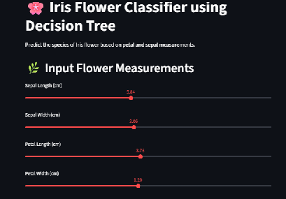
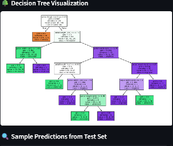
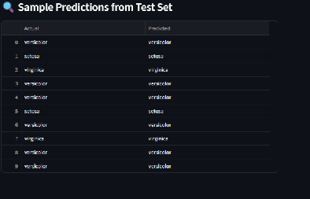
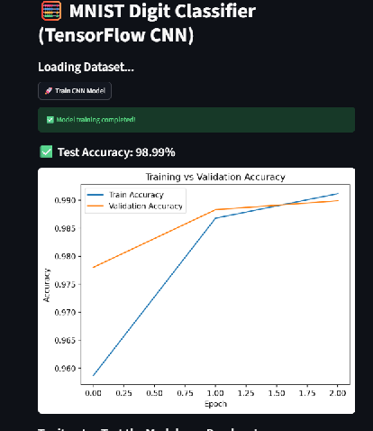
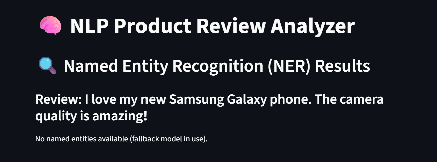

#  AI Tools Assignment — *Mastering the AI Toolkit*  

A collection of interactive **Streamlit applications** showcasing core **Artificial Intelligence**  concepts — including **Machine Learning**, **Deep Learning**, and **Natural Language Processing**  all developed from hands-on **Jupyter notebooks** and transformed into deployable Apps. 

##  Overview 

This project brings together a collection of interactive AI applications designed to demonstrate 
the practical use of modern AI tools and frameworks. 

Each app transforms theoretical concepts into real-time, hands-on experiences using Streamlit, 
making it easy to explore how AI works behind the scenes. 

The project focuses on three core domains of Artificial Intelligence: 

- 🧠 Machine Learning: Predicting flower species using the Iris dataset. 
- 🤖 Deep Learning: Recognizing handwritten digits from the MNIST dataset. 
- 💬 Natural Language Processing: Analyzing and visualizing sentiments in product reviews. 

Together, these tools illustrate how AI can process data, make predictions, and interpret  
human language — turning abstract models into interactive, educational, and functional applications. 

## ✨ Features 
- Interactive ML and NLP visualizations 
- Real-time predictions with trained models 
- Clean Streamlit interface 
- Modular structure for scalability 
- Auto-handling of model dependencies (like spaCy)  

## 📂 Project Structure 
```
AI-Tools-Assignment/
├── app_streamlit/
│   ├── iris_app.py          
│   ├── mnist_app.py         
│   ├── nlp_app.py           
│   ├── requirements.txt     
├── notebooks/
│   ├── iris_notebook.ipynb
│   ├── mnist_notebook.ipynb
│   ├── nlp_notebook.ipynb
└── README.md
```

##  Tech Stack & Tools 

This project integrates powerful AI, data science, and deployment frameworks into a seamless workflow.  
It showcases how modern tools can be combined to build, visualize, and deploy intelligent applications efficiently. 

###  Core AI & Data Science Libraries 
- **spaCy** — Natural Language Processing for Named Entity Recognition (NER), tokenization, and text visualization.   
- **scikit-learn** — Machine Learning algorithms for classification, prediction, and data modeling.   
- **TensorFlow** — Deep Learning framework for training and evaluating neural networks.   
- **Pandas** & **NumPy** — Data manipulation, cleaning, and numerical computations.   
- **Matplotlib** — Visual representation of datasets and model insights. 

###  Interface & Deployment 
- **Streamlit** — Python-based web framework for building interactive, real-time AI applications.  

###  Development Environment 
- **Jupyter Notebook** — Used for model prototyping, experimentation, and exploratory analysis.   
- **Git & GitHub** — Version control, collaboration, and cloud-based code management. 

###  Supporting Utilities  
- **Pillow** — Image handling and preprocessing for model inputs.   
- **subprocess** + **sys** — Used to dynamically install spaCy models (`en_core_web_sm`) within the app. 


##  Installation & Setup 

Follow these steps to set up and run the project locally on your machine.  
This guide ensures you have the correct environment to run the Streamlit apps and Jupyter notebooks smoothly.  

### 1. 📥 Clone the Repository 
```
git clone https://github.com/Bblasio/AI_Tools.git
cd AI_Tools
```
### 2.Create a virtual environment
python -m venv venv

### 3. Activate it (Windows)
venv\Scripts\activate

### Or (macOS / Linux)
source venv/bin/activate
### Install dependencies
pip install -r requirements.txt
### Example: Run the NLP app
streamlit run app_streamlit/nlp_app.py


Choose an app and run it with Streamlit

```
streamlit run iris_app.py
streamlit run mnist_app.py
streamlit run nlp_app.py

```
##  Use Cases 

This project demonstrates the real-world applications of Artificial Intelligence through a set of  modular and interactive Streamlit apps.   
Each app focuses on a key AI domain, translating theoretical concepts into functional tools that  can analyze data, make predictions, or interpret human language. 

---

### 1. 🌸 Machine Learning App — *Iris Flower Classifier*  
This app applies classical machine learning techniques to predict flower species based on petal and sepal measurements.  
It provides an intuitive interface for users to understand how models learn patterns from structured data. 

**Features:** 
- Implements supervised learning algorithms using **scikit-learn**.   
- Allows users to input custom measurements for prediction.   
- Displays training accuracy, confusion matrix, and performance metrics.  
- Offers visual plots to show decision boundaries and model behavior. 

**Use Case**  
Used for predictive modeling tasks — for instance, classifying species, products, or customer segments based on quantitative data. 

---

### 2.  Deep Learning App — *MNIST Digit Recognizer* 
This app demonstrates how a neural network can identify handwritten digits using the **TensorFlow** framework.   
It visually shows how deep learning processes image data to make accurate predictions. 

**Features** 
- Trains and tests a simple convolutional neural network (CNN) on the MNIST dataset.   
- Visualizes model predictions and accuracy in real time.  
- Allows users to understand how neural networks detect image patterns.  

**Use Case**  
Ideal for tasks such as digit recognition, document analysis, or any image-based classification problem. 

---

### 3. Natural Language Processing App — *Product Review Analyzer* 
This app focuses on language understanding using **spaCy**, blending entity recognition with basic sentiment analysis.   
It helps users visualize how AI interprets human text and extracts meaningful insights. 

**Features**  
- Performs Named Entity Recognition (NER) to highlight key terms (brands, products, etc.).   
- Analyzes sentiment using a rule-based scoring system.   
- Renders entity visualization directly within Streamlit via **displaCy**.  
- Automatically downloads required spaCy models if missing. 

**Use Case**  
Useful for analyzing customer reviews, extracting brand mentions, or summarizing text-based feedback in e-commerce and marketing. 

---

### 4. 📓 Jupyter Notebook Experiments 
Each Streamlit app originates from an interactive Jupyter notebook, which documents the end-to-end process from dataset exploration to model deployment. 

**Features** 
- Step-by-step model training and tuning.  
- Visual analysis of datasets and performance metrics.  
- Serves as a reference for learners and developers to understand AI workflows. 

**Use Case**  
Best suited for academic exploration, prototyping, and collaborative AI experimentation. 

---
###  Deployment 

The project is fully deployed on **Streamlit Cloud**, making it accessible directly through a web browser — no installations or complex setup required.  
Each AI module runs as an independent interactive app, allowing users to explore machine learning, deep learning, and NLP concepts in real time. 

###  Live Demo Links

-  **Machine Learning App (Iris Classifier)** → [Open App](https://classicalml.streamlit.app/)  
-  **Deep Learning App (MNIST Digit Recognizer)** → [Open App](https://cnnmodeldl.streamlit.app/)  
-  **Natural Language Processing App (Product Review Analyzer)** → [Open App](https://aitools-2ph753kv2yhstqkjacmdqs.streamlit.app/)  

Each app is containerized and hosted for consistent performance and easy scalability. 

---

---
## 🖼️ Screenshots

This section showcases the key visual elements and outputs from each of the three AI applications.   
Each screenshot highlights a core feature or visualization from the deployed Streamlit apps. 

---

### 🌸 Machine Learning — *Iris Classification App* 

| Input Flower Measurement | Decision Tree Visualization | Sample Data Prediction |
|:-------------------------:|:---------------------------:|:----------------------:|
|  |  |  |

---

### 🔢 Deep Learning — *MNIST Digit Recognizer* 

| Test Accuracy | Digit in Image | Predicted Output |
|:--------------:|:---------------:|:----------------:|
|  |  |  |

---

### 💬 Natural Language Processing — *Product Review Analyzer* 

| Sample Output Screenshot |
|:-------------------------:|
|  |

---
>
## 👨‍💻 Author 
**CHEPKURUI SHEILAH**   
https://github.com/shila-96

